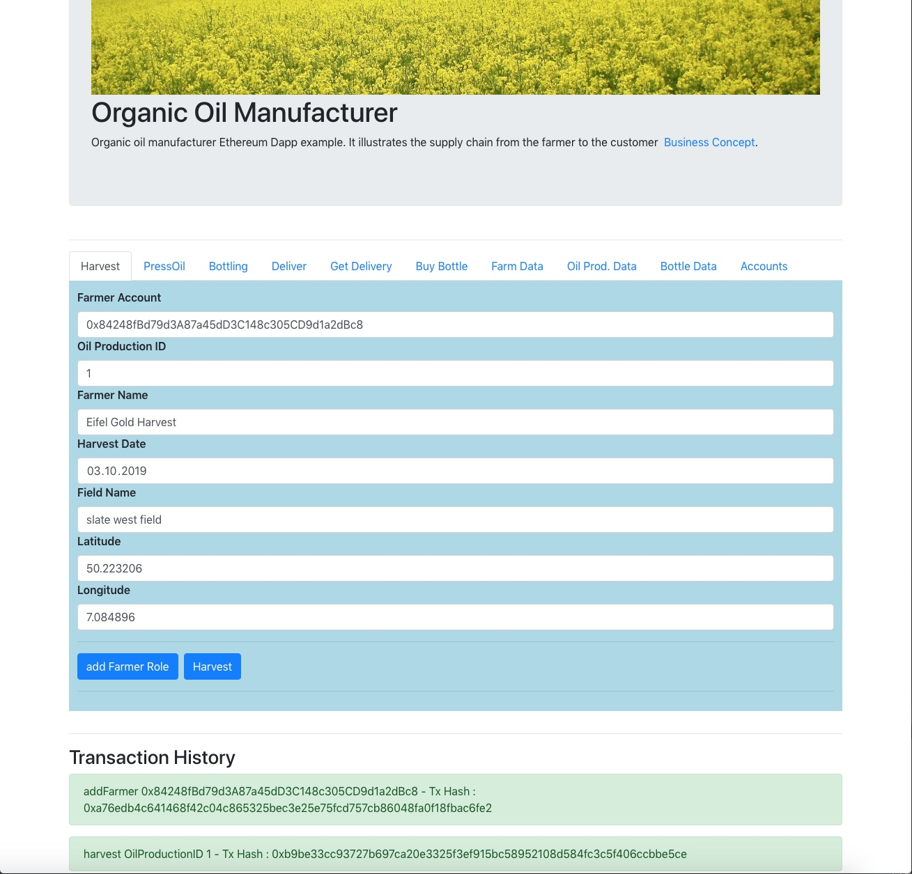
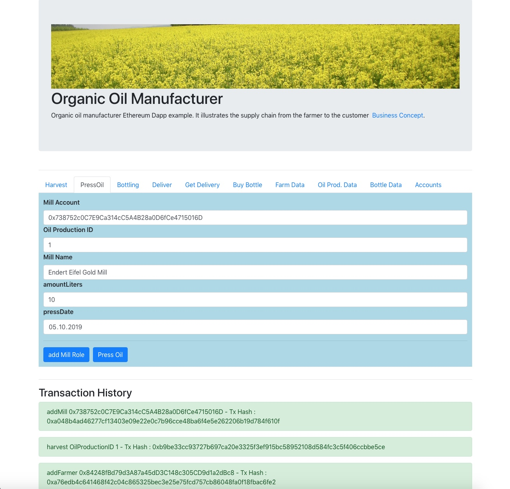
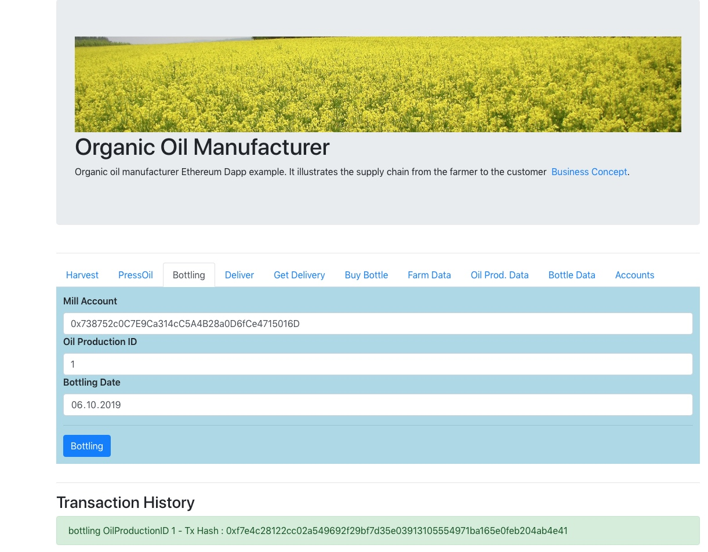
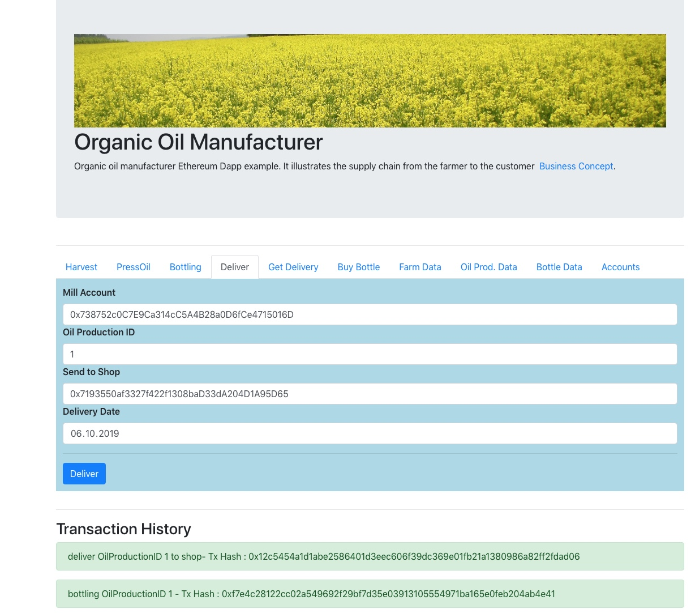
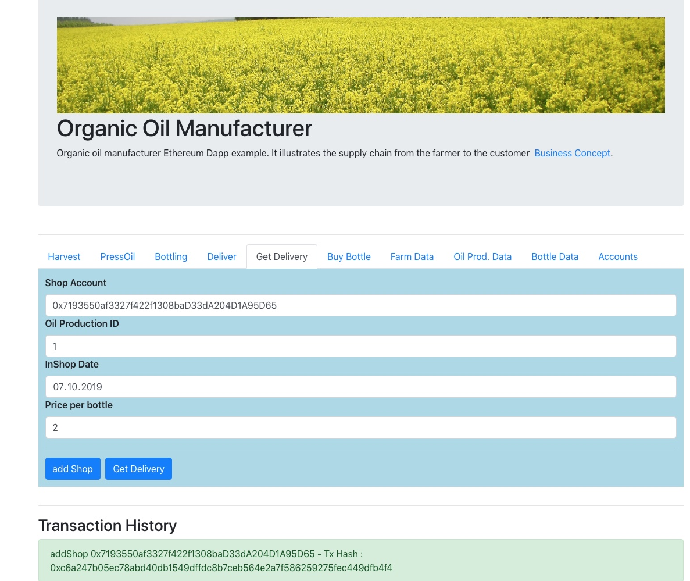
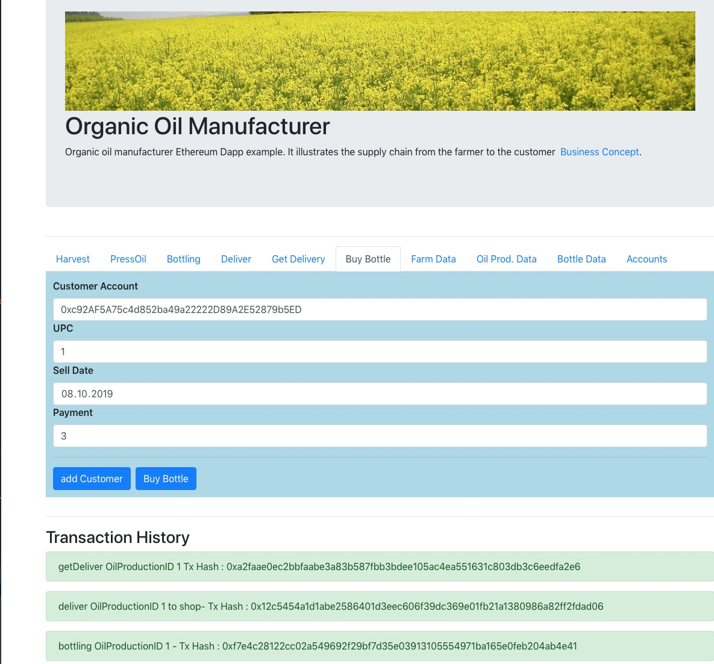
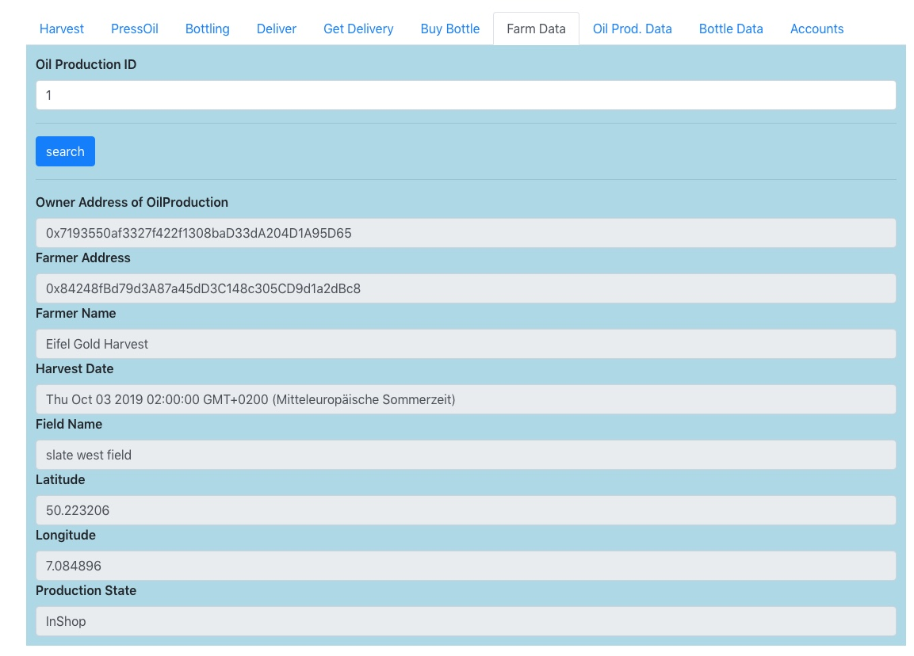
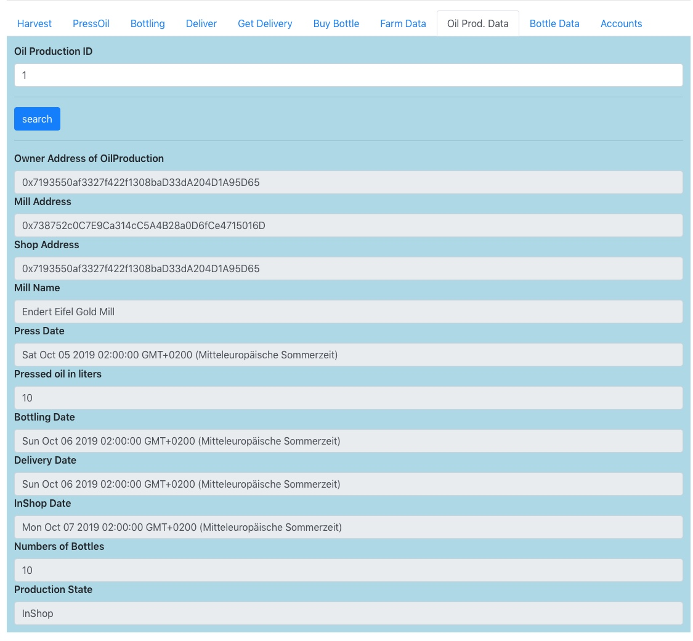
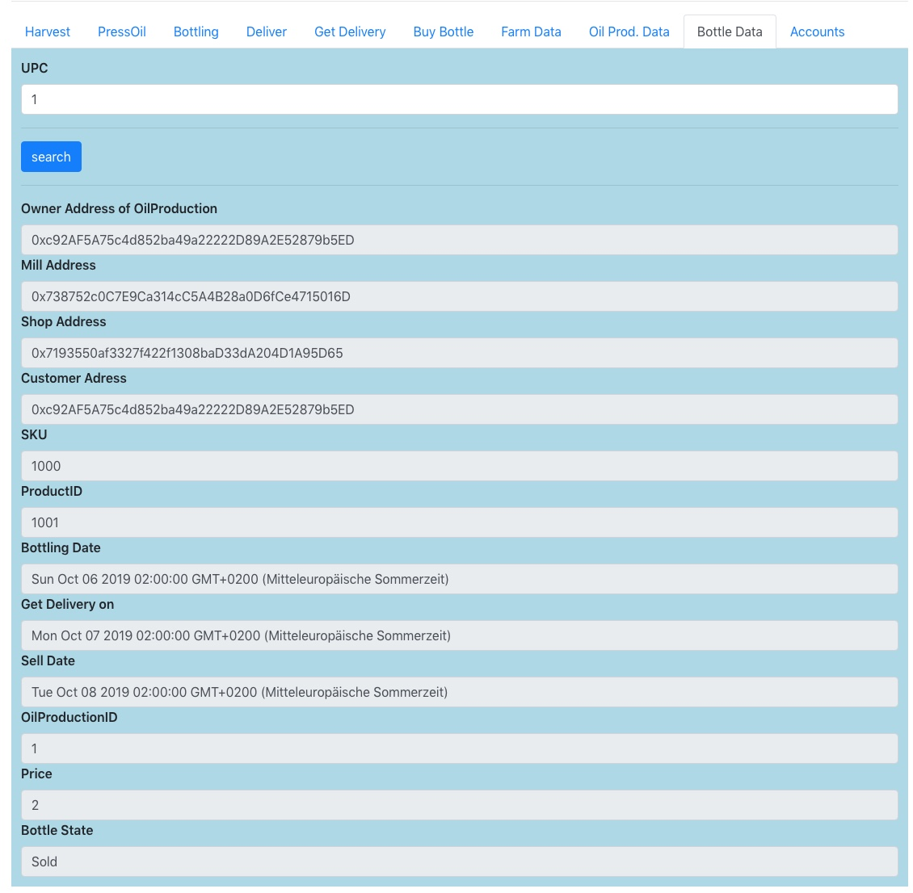

# Business Process

The following Business Process describes the process from harvesting to buying. A screenshot illustrates every step. The Web UI is a prototype that shows the possibilities of DApp application to support your business use cases.

## Harvest

A farmer harvests on the seed on a field.  AddFarmer and Harvest are separate use cases. In a real business application, this is part of application administration.

## Press oil

Press oil describes the process of pressing the seed. Only a Mill can press the seed. So you have to add the mill role to an address.

## Bottling

The Miller fills up the oil into the bottles. Each bottle has a volume of one Liter. If you have 10 Liters of seed, you get ten bottles.

## Deliver

The Miller send the bottles back to the farm shop.

## Get Delivery

The shop got the delivery of the mill and but the bottles into the shops. Only the shop can use get delivery. You have to add an address to the shop role.

## Buy Bottle

Buy bottle a customer buy a bottle in the shop. You have to add an address to the customer role.

## Farm Data

Show the Data of a Farm. It's part of the Oil Production.

## Oil Production 

Oil production data shows the relevant data from the mill to the shop.

## Bottle Data

Bottle data include all essential data from the mill to the customer for each data.

