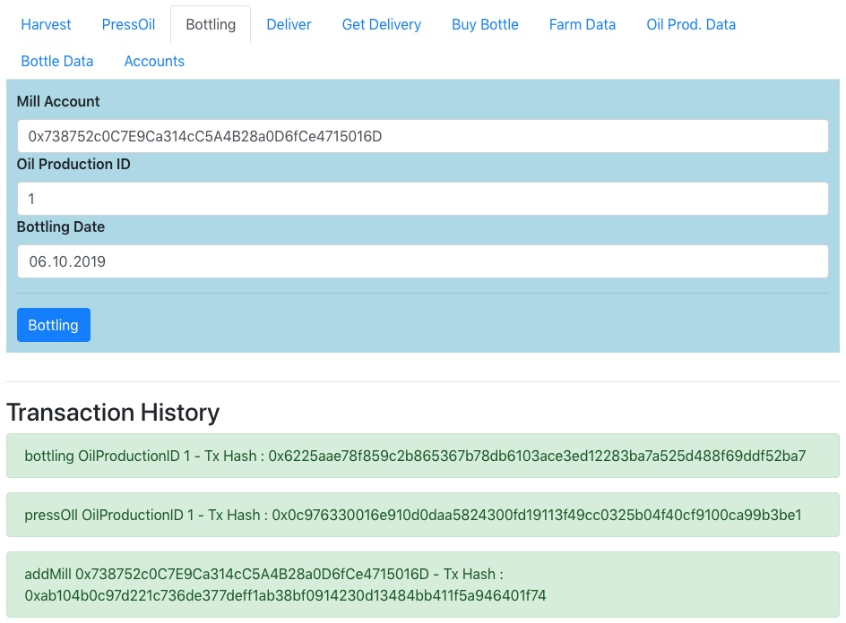
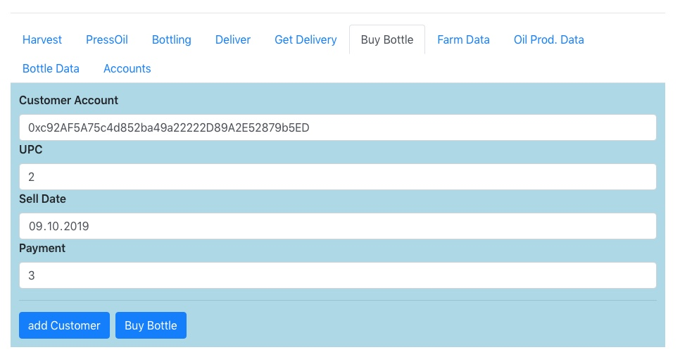

# Business Process

The following Business Process describes the process from harvesting to buying. A screenshot illustrates every step. The Web UI is a prototype that shows the possibilities of DApp application to support your business use cases.

## Harvest

A farmer harvests on the seed on a field.  AddFarmer and Harvest are separate use cases. In a real business application, this is part of application administration.

## Press oil

## Bottling

## Deliver

## Get Delivery

## Buy Bottle

## Farm Data

## Oil Production Data

## Bottle Data

