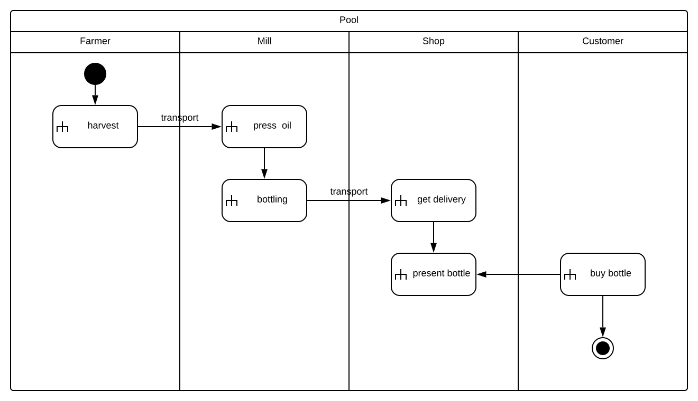
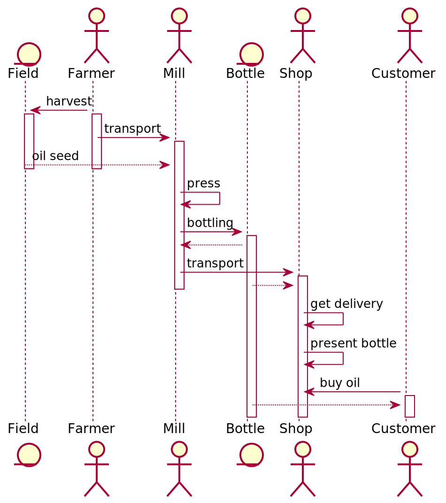
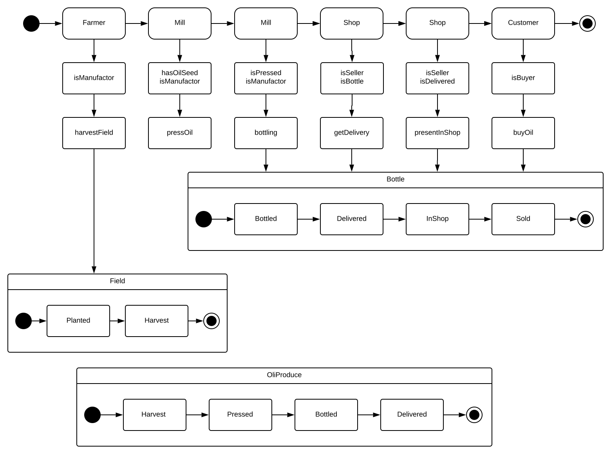
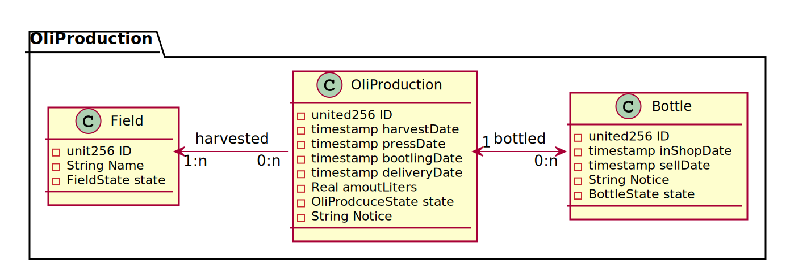
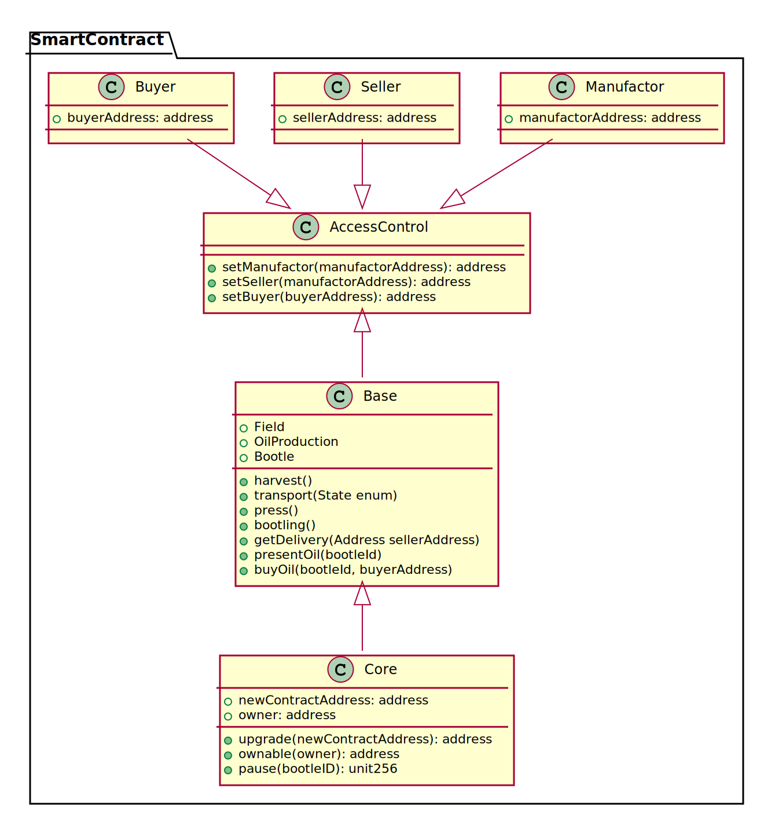

# Organic Oil Manufacturer
Organic oil manufacturer Ethereum Blockchain example

## Story
The organic farmer Bob produces exclusive rapeseed oils.  Bob presses the oils in a nearby rapeseed mill. Afterward, he sells the oils at the farm shop.   The oil is bottling in one-liter bottles, and each bottle has a unique identity code. Farming and the Harvest store (selling) are separate concerns.  When Bob plans to produce oil, he harvests one or more fields and transports the seed to the mill. The mill pressed and bottled the oil. Bob will do all administrative stuff for the mill.

This example shows the possibilities of tracking of products like wine, beer, bread, or products in chemical or pharmaceutical industries. It tracks the products from the field to the customer. The example has one primary essence and two production steps.

## Activity Diagram

This Activity Diagram identifies the main activities for each actor in the oil production process.

## Sequence Diagram

This Sequence Diagram illustrates the interaction between the actor for a default production and sale process.

## State Diagram

This State Diagram identifies states for the Entities Bottle and Field and the Oil Production Process.

## Domain Model

### Business Logic

This Class Diagram describes the relations of the entities in the business domain model.

### SmartContract Logic

This Class Model describes the relations in the technical SmartContract environment.

## Implementation
Realization as Ethereum Smart Contracts. [Implementation](https://github.com/Eifel42/organicOilSupply)

## Authors
Stefan Zils

## Acknowledgments
* udacity
